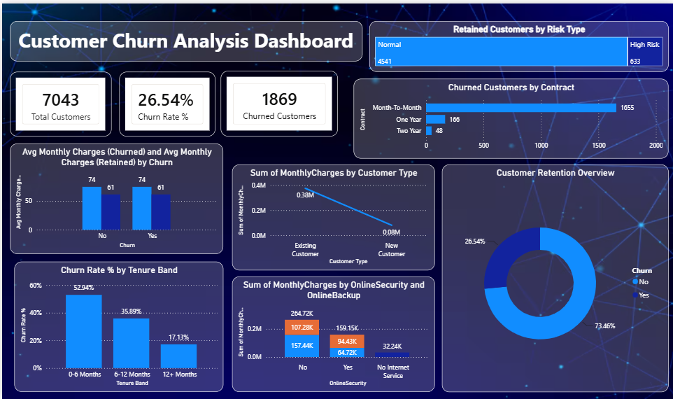

# Customer Churn Analysis Dashboard

## Overview
This project analyzes customer churn using Power BI. The dashboard provides insights into customer behavior, churn rate, contract types, tenure, monthly charges, and retention patterns.

## Tools Used
- Power BI
- Power Query
- DAX
- Excel / CSV

## Dashboard Features
- Total Customers
- Churn Rate
- Churned Customers
- Customer Type Analysis
- Monthly Charges Analysis
- Contract-wise Churn
- Tenure Band Analysis
- Customer Retention Overview

## Dataset
Telco Customer Churn Dataset

## Dashboard Preview

